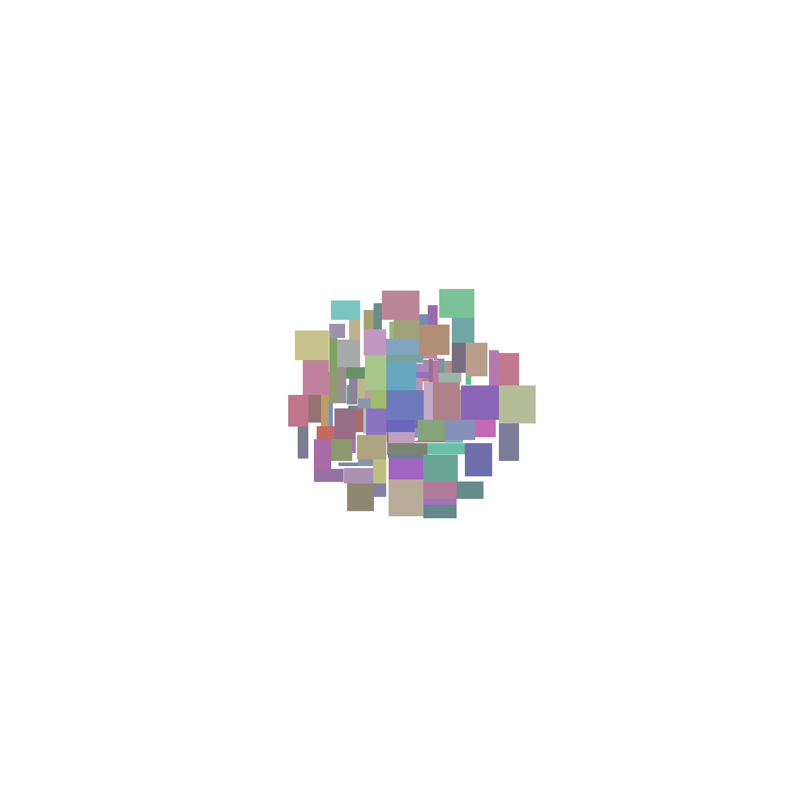
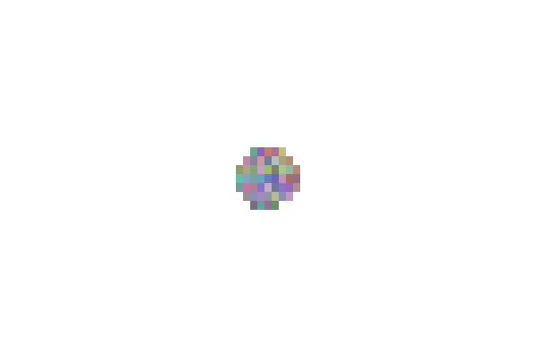
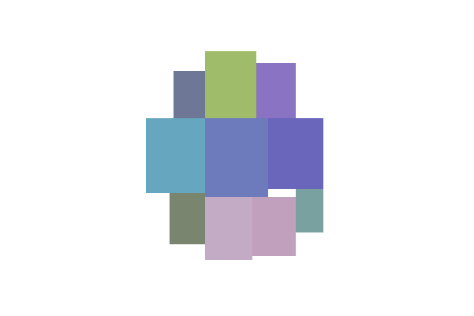

# Алгоритм делает следующее
* Первый прямоуголник ставит по центру
* Последущие ставит в смежных углах к существующему, так чтобы расстояние от центра, до наибольшего угла будет минимальным.

#Примеры

